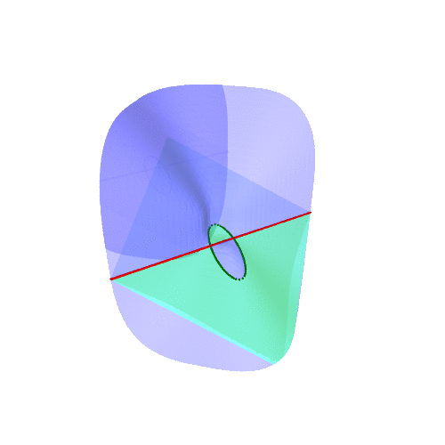

:PROPERTIES:
:ARCHIVE:  %s_archive::
:nav-title: Home
:skip-backlinks: t
:ID:       d990bcc9-227c-4e82-9e93-512139e14f45
:END:
#+title: Anand Deopurkar
#+description: Website of Anand Deopurkar, a mathematician specialising in algebraic geometry at the Australian National University.  Browse my papers, courses, and projects.  Get in touch with comments, thoughts, or ideas.
#+keywords: Anand Deopurkar, mathematics, ANU, algebraic geometry, MSI 
#+OPTIONS: H:1 html-preamble:nil num:0
#+setupfile: #setup.org

#+begin_intro
#+attr_html: :id mypicture :alt Anand Deopurkar

[[http://maths.anu.edu.au/][Mathematical Sciences Institute]]\\
[[https://anu.edu.au][The Australian National University]]\\
Canberra, Australia

[[mailto:anand.deopurkar@anu.edu.au][anand.deopurkar at anu dot edu dot au]] ([[file:ananddeopurkar-pgp.asc][pgp]])\\
[[http://www.anu.edu.au/maps#show=102872][Hanna Neumann Building]] 4.56\\
+61 2 6125 8398   

CV: [[file:cv.html][html]] [[file:cv.pdf][pdf]]

I am a mathematician working in algebraic geometry and related areas.
I study the interplay between systems of algebraic equations and the geometric shapes they describe.

#+TOC: headlines:1

#+end_intro

* now 
:PROPERTIES:
:ARCHIVE: past.org::datetree/
:END:
If you are thinking of doing a PhD with me, please read this [[id:1a667b02-c72c-4225-acbc-d5064ab2f748][page for prospective PhD students]].
** With [[asilata][Asilata Bapat]] and [[tony][Tony Licata]], I am studying [[wiki:Bridgeland_stability_condition][Bridgeland stability conditions]] on some triangulated categories.
** With [[rachel:][Rachel Newton]], [[vaidehee:][Vaidehee Thatte]], and [[rosa:][Rosa Winters]], I am exploring arithmetic ramifications of the geometry of certain [[wiki:Hurwitz_scheme][Hurwitz spaces]].
** [[oliver:][Oliver Li]] and I are working on the equivariant enumerative geometry of plane curves.  
** [[jayan:][Jayan Mukherjee]] and I are trying to understand non-reduced double structures on curves (ribbons) and surfaces (carpets).
** [[anandpatel:][Anand Patel]] and I threw every tool we knew at a cool enumerative problem ([[https://arxiv.org/abs/2411.14232][counting 3-uple Veronese surfaces]]) whose answer comes out to \(4246\).  *UPDATE* [[timduff:][Timothy Duff]] successfully verified this numerically!  
** This semester (2026 S1), I am teaching /Algebra 2 (Fields and Galois Theory)/.  
** Upcoming travel
 - Sydney (June 2026) for a seminar at UNSW.
 - Melbourne (July 2026) for a the workshop [[https://algemel.github.io/][Algebraic Geometry in Melbourne]] that I am organising with [[jackhall:][Jack Hall]] and [[norbury:][Paul Norbury]].
 - Sydney (February 2027) for the Forum on Artin and Coxeter groups: Examples and Theory
** ... [[id:6580b2b4-26bc-4483-a674-3fd5385bb1ad][more "now" items from the past]].

* Papers/pre-prints
#+begin_src emacs-lisp :exports results :results value raw drawer :lexical t
  (defun my/paper-pp ()
     (let* ((id (org-id-get-create))
  	  (title (org-entry-get nil "ITEM"))
  	  (journal (org-entry-get nil "WHERE"))
  	  (coauthors (org-entry-get nil "WITH"))
  	  (with (if coauthors
  		    (format ", with %s" coauthors)
  		  ""))
  	  (links (org-entry-get nil "LINKS")))
       (format "- [[id:%s][%s]]%s (%s)\\\\\n  /%s/." id title with links journal)))
  (string-join
   (org-map-entries 
    'my/paper-pp
    "+paper-expository|+preprint-expository"
    '("papers/index.org")
    )
   "\n")
#+end_src

#+RESULTS:
:results:
- [[id:1245acba-aa78-4ab6-ad92-fb1c2c46b5c6][A sphere of spherical objects]], with [[asilata:][Asilata Bapat]], [[tony:][Anthony Licata]] ([[file:./spherical-sphere.pdf][pdf,]] [[https://arxiv.org/abs/2509.13912][arxiv]])\\
  /Pre-print/.
- [[id:991da63b-3869-43c6-ae34-3cfb65a88e1e][The Thurston compactification of the stability manifold of a generic analytic K3 surface]] ([[file:./CompStabGenK3.pdf][pdf]], [[https://github.com/deopurkar/CompStabGenK3][repository]])\\
  /Mathematical Research Letters (accepted)/.
- [[id:fe485808-abd5-47a3-8989-33302bddd1f1][Compactifications of moduli spaces of K3 surfaces with a higher-order nonsymplectic automorphism]], with [[valery:][Valery Alexeev]], [[changho:][Changho Han]] ([[file:./k3z3.pdf][pdf]], [[https://arxiv.org/abs/2412.11256][arxiv]])\\
  /Pre-print/.
- [[id:c6c78ad7-7a03-4b03-95d8-ab4cd5450fb8][Syzygies of canonical ribbons on higher genus curves]], with [[jayan:][Jayan Mukherjee]] ([[file:./highergenusribbons.pdf][pdf]], [[https://arxiv.org/abs/2412.05500][arxiv]])\\
  /Pre-print/.
- [[id:83eab6f9-e798-499b-bff5-cdea76b092c8][Counting 3-uple Veronese surfaces]], with [[anandpatel:][Anand Patel]] ([[file:./3veroneseP2.pdf][pdf]], [[https://arxiv.org/abs/2411.14232][arxiv]])\\
  /Pre-print/.
- [[id:b1ba9384-4b6a-47b1-888c-61cc0c828493][Equivariant classes of orbits in GL(2)-representations]] ([[file:./gl2orbits.pdf][pdf]], [[https://arxiv.org/abs/2405.09849][arxiv]], [[https://github.com/deopurkar/equivariant-classes-of-gl2-orbits/][repository]])\\
  /Selecta Mathematica (accepted)/.
- [[id:e4f6d1ab-1a2b-4def-bbbd-092960a347f1][Orbits of linear series on the projective line]], with [[anandpatel:][Anand Patel]] ([[file:./erc.pdf][pdf]],[[https://arxiv.org/abs/2211.16603][ arxiv]], [[https://doi.org/10.1093/imrn/rnae169][journal]])\\
  /International Mathematics Research Notices/.
- [[id:aa908035-6504-4bd7-8a1d-aecf14f07383][A universal formula for counting cubic surfaces]], with [[anandpatel:][Anand Patel]], [[dennistseng:][Dennis Tseng]] ([[file:./countingcubics.pdf][pdf]], [[https://arxiv.org/abs/2109.12672][arxiv]])\\
  /Algebraic Geometry (to appear)/.
- [[id:8c1b044d-82a9-4cbc-986e-a07f93dc93d1][Spherical objects and stability conditions on 2-Calabi--Yau quiver categories]], with [[asilata:][Asilata Bapat]], [[tony:][Anthony Licata]] ([[file:./2cy-algorithm.pdf][pdf]],[[https://arxiv.org/abs/2108.09155][ arxiv]], [[https://link.springer.com/article/10.1007/s00209-022-03172-8][journal]])\\
  /Mathematische Zeitschrift/.
- [[id:4b773769-0ca6-42a8-a8e6-309dd23ffa5c][Vector bundles and finite covers]], with [[anandpatel:][Anand Patel]] ([[file:./ebundle.pdf][pdf]], [[https://arxiv.org/abs/1608.01711/][arXiv]], [[https://www.cambridge.org/core/services/aop-cambridge-core/content/view/21EB07C62F7A142F5CC39EF3950C2231/S2050509422000196a.pdf/vector_bundles_and_finite_covers.pdf][journal]])\\
  /Forum of Mathematics, Sigma/.
- [[id:f7400180-00b7-4b54-a902-8941b3bd3823][Stable log surfaces, admissible covers, and canonical curves of genus 4]], with [[changho:][Changho Han]] ([[file:./TrigonalKSBA.pdf][pdf]],[[https://arxiv.org/abs/1807.08413/][ arxiv]], [[https://www.ams.org/journals/tran/2021-374-01/S0002-9947-2020-08225-7/?active=current][journal]])\\
  /Transactions of the Americal Mathematical Society/.
- [[id:7ee039fe-461d-41bb-8a73-116bc7f196e0][A Thurston compactification of the space of stability conditions]], with [[asilata:][Asilata Bapat]], [[tony:][Anthony Licata]] ([[file:./a2-compactification.pdf][pdf]], [[https://arxiv.org/abs/2011.07908][arxiv]])\\
  /Pre-print/.
- [[id:82e9302f-6674-41b8-97cd-6733ac7edf89][Ramification divisors of general projections]], with [[eduardduryev:][Eduard Duryev]], [[anandpatel:][Anand Patel]] ([[file:./PR.pdf][pdf]], [[http://arxiv.org/abs/1901.01513/][arxiv]], [[https://ems.press/journals/dm/articles/8965720][journal]])\\
  /Documenta Mathematica/.
- [[id:931c8753-71af-4498-89fe-5823ae74d1e9][Anticanonical tropical cubic del Pezzos contain exactly 27 lines]], with [[mariacueto:][María Angélica Cueto]] ([[file:./lines_on_tropical_cubics.pdf][pdf]], [[https://arxiv.org/abs/1906.08196][arxiv]])\\
  /Pre-print/.
- [[id:1d0dda32-8233-4fd8-8303-a6d7e16dc0cc][Covers of stacky curves and limits of plane quintics]] ([[file:./StackyAdmissibleCovers.pdf][pdf]], [[http://arxiv.org/abs/1507.03252/][arxiv]], [[https://www.ams.org/journals/tran/2019-371-01/S0002-9947-2018-07301-9/home.html][journal]])\\
  /Transactions of the Americal Mathematical Society/.
- [[id:e4a32e17-c28b-45a2-bfb1-8622e151af99][Syzygy divisors on Hurwitz spaces]], with [[anandpatel:][Anand Patel]] ([[file:./HigherMaroni.pdf][pdf]], [[https://arxiv.org/abs/1805.00648][arxiv]], [[https://www.ams.org/books/conm/703/14139][journal]])\\
  /Contemporary Mathematics/.
- [[id:c399a596-99cb-41bc-945b-a2846c40757e][The canonical syzygy conjecture for ribbons]] ([[file:./RibbonGreen.pdf][pdf]], [[http://arxiv.org/abs/1510.07755/][arxiv]])\\
  /Mathematische Zeitschrift/.
- [[id:800287ce-183c-42d7-ad07-0f73202dc7c3][Toward GIT stability of syzygies of canonical curves]], with [[maksym:][Maksym Fedorchuk]], [[davidswinarski:][David Swinarski]] ([[file:./gitsyzygy.pdf][pdf]], [[http://arxiv.org/abs/1401.6101/][arxiv]], [[http://www.algebraicgeometry.nl/2016-1/2016-1-001.pdf][journal]])\\
  /Algebraic Geometry/.
- [[id:e0e0aebf-32c6-4041-95d5-16574e6c0513][The Picard rank conjecture for the Hurwitz spaces of degree up to five]], with [[anandpatel:][Anand Patel]] ([[file:./PicH345.pdf][pdf]], [[http://arxiv.org/abs/1401.6101/][arxiv]], [[http://msp.org/ant/2015/9-2/p05.xhtml][journal]])\\
  /Algebra & Number Theory/.
- [[id:b355cfa4-8d4b-4110-93f7-f85699fe3e36][Groebner techniques for ribbons]], with [[maksym:][Maksym Fedorchuk]], [[davidswinarski:][David Swinarski]] ([[file:./groebner.pdf][pdf]], [[https://sites.google.com/site/albjmath/archives/vol-8/2014-6][journal]])\\
  /Albanian Journal of Mathematics/.
- [[id:504645b5-633e-42dd-9727-2c83fd1bb8d3][Compactifications of Hurwitz spaces]] ([[file:./CompHurwitz.pdf][pdf]], [[http://arxiv.org/abs/1206.4535/][arxiv]], [[http://imrn.oxfordjournals.org/content/early/2013/04/08/imrn.rnt060.abstract][journal]])\\
  /International Mathematics Research Notices/.
- [[id:3b6a466e-3eef-4ba3-9515-07dcf2a34e83][Class of the Hodge eigenbundle using orbifold Riemann-Roch]] ([[file:./CyclicAppendix.pdf][pdf]])\\
  /Pre-print, appendix to [[https://drive.google.com/file/d/1wq-Fh3DiqODc51t-J0phIexVF7B4lxsY/view][/Cyclic covering morphisms on \(\overline M_{0,n}\)/]] by [[https://www2.bc.edu/maksym-fedorchuk/][Maksym Fedorchuk]]/.
- [[id:75d3ebc0-1174-40e1-9ec5-a949bad877de][Sharp slope bounds for sweeping families of trigonal curves]], with [[anandpatel:][Anand Patel]] ([[file:./TrigonalSlopes.pdf][pdf]], [[http://arxiv.org/abs/1211.2827/][arxiv]], [[http://www.intlpress.com/site/pub/pages/journals/items/mrl/content/vols/0020/0005/a005/][journal]])\\
  /Mathematical Research Letters/.
- [[id:833f39b4-0d38-4903-8356-aac9fc2b16d0][Modular compactifications of the space of marked trigonal curves]] ([[file:./MarkedTrigonal.pdf][pdf]], [[http://arxiv.org/abs/1206.4503/][arxiv]], [[https://www.sciencedirect.com/science/article/pii/S0001870813002776][journal]])\\
  /Advances in Mathematics/.
:end:

* Expository 
Here are some of my [[id:05f9493f-833e-4f64-a2b5-321a11c91a3b][expository articles and talks]].    

#+begin_src elisp :exports results :results value raw drawer
  (string-join
   (remove
    nil
    (scan-dir-for-id "05f9493f-833e-4f64-a2b5-321a11c91a3b" ;expository.org
  		   project-root-directory
  		   (lambda (pom)
  		     (let ((tags (org-get-tags pom)))
  		       (when (member "highlight" tags)
  			 (format
  			  "- %s%s"
  			  (pretty-print-backlink pom)
  			  (if
  			      (or
  			       (member "preprint" (org-get-tags pom))
  			       (member "paper" (org-get-tags pom)))
  			      (concat "\n  /"
  				      (org-entry-get pom "where") "/")
  			    "")))))))
   "\n")
#+end_src

#+RESULTS:
:results:
- [[id:0f97be8d-e4d3-4515-bf1f-981c9e8380a0][An introduction to intersection homology]] ([[file:./anandrd_minor_thesis.pdf][pdf]])
  /Minor thesis (Harvard)/
- [[id:9efcc78f-db58-4c06-a73a-405566487ca4][The arithmetic and geometry of branched coverings: theorems of Belyi and Darmon--Granville]] ([[file:./arithmetic_covers.pdf][pdf]])
  /Pre-print/
- [[id:5b14bbaa-5b4d-4170-81d8-46ffc0b65716][How to count using (co)homology (talk, Tata Institute of Fundamental Research)]] ([[file:2018-tifr.pdf][notes]])
- [[id:c66380b2-8eca-4313-8360-16b28533e3fe][The work of Caucher Birkar (talk, Australian National University)]] ([[file:2018-FMColloquium.pdf][notes]])
- [[id:53fe8ada-0bc4-439b-9763-84cbb137727b][The work of Maryam Mirzakhani (talk, Australian National University)]] ([[id:e5dcac8c-b6ff-4e38-919b-c90d821d4187][notes]])
:end:

* Teaching
Here are some of [[id:cbb16489-0d75-4466-bf36-240257da8f58][the courses I have taught]].
#+begin_src emacs-lisp :exports results :results value raw drawer
  (concat " - "
  	(string-join
  	 (remove nil
  		 (org-map-entries
  		  (lambda ()
  		    (when (member "highlight" (org-get-tags))
  		      (pretty-print-backlink (point))))
  		  "level=1"
  		  '("teaching/index.org")))
  	 "\n - "))
#+end_src
#+RESULTS:
:results:
 - [[id:2a953d2a-e23a-4c6b-a289-d7eabf2c5372][Games, graphs, and machines, 2025]] ([[id:6d38a9f2-2aef-4ad5-848f-fcf0443b096d][course page]])
 - [[id:61a488d3-6299-41db-8d8f-22a52c218168][Fields and Galois theory (Algebra 2), 2025]] ([[id:8da0831f-565c-4a15-b356-7604a5ac0c1b][course page]])
 - [[id:ff0be012-9844-46a2-b477-6c93891795b0][Differential forms in algebraic topology, 2024]] ([[id:d4cff607-a97d-4665-a57e-246aa8d6b8a5][course page]])
 - [[id:758f10f4-87b2-4f06-bf29-4ff996b8ad98][Groups and rings (Algebra 1), 2022]] ([[id:e61cc576-b305-4296-b50b-0bc8a5f8aab2][course page]])
 - [[id:3e570a8d-7ffa-4b1c-b8ac-c2077e6e894c][Mathematical writing, 2022]] ([[id:140c6f8d-abc0-4763-aead-b2834a41f665][course page]])
 - [[id:1680737a-9d54-448d-8951-a0fe1ae16016][Algebraic Geometry (Algebra 3), 2021]] ([[id:d86f42ff-f826-4c2a-9e1f-b85a7934e6c0][course page]])
 - [[id:22f29317-d339-4e49-b46a-17a34e0b6091][Foundations of Algebraic Geometry: Schemes, 2020]] ([[id:bf031ad4-94a5-42bd-8606-70e9cf0aec5f][course page]])
 - [[id:2a240d8e-a930-4e2c-a160-d39ff51e7447][Algebraic curves, 2017]] ([[id:c0b9ba79-93e6-41cf-909e-efd0be13a8de][course page]])
 - [[id:6b8e011c-0df8-46e7-9674-48d1dcea50f5][Young tableaux in algebra and geometry, 2015]] ([[file:2015_young_tableaux/][course page]])
 - [[id:ecfad00a-6580-4202-a4b6-b7cee3169314][Moduli of curves, 2014]] ([[file:2014_moduli_of_curves/][course page]])
:end:

* Odds and ends

- [[file:genus7syz/][GIT for syzygies of genus 7 curves]]\\
  This is an ongoing project to determine GIT stability for syzygies of genus 7 canonical curves.
  This is the first genus where canonical syzygies define an interesting GIT quotient, so it would be nice to understand the complete picture.
  One day...

- [[https://github.com/asilata/cobracat][Categorical braid group actions]]\\
  With [[https://asilata.github.io][Asilata Bapat]], I wrote ~Sage~ code to make explicit computations in the homotopy category of projective modules over a ring.
  In particular, this code can compute braid actions on complexes of projective modules over the zig-zag algebra of a quiver.

- [[https://ananddeopurkar.org/msicg/][MSI course graph]]\\
  This is an interactive dependency graph of ANU math department's course catalogue.

- [[file:misc/puzzle.pdf][A mystery hunt style puzzle]]

- Some visualisations
  - [[file:misc/blowup-of-a-triple-point.html][The blow up of a planar triple point]] ([[file:misc/blowup-of-a-triple-point.sage][sage code]])
  -  ([[file:misc/cubic-fibration.sage][sage code]])

- Notes from some past seminars
 - [[id:37dcbcd5-30ec-489c-bb01-a7b09cde3a17][DbCoh: ANU, 2021]]
 - [[id:cf1faa8e-1f6c-4959-92e8-d06827646698][Mixed hodge modules]]: UGA, 2017
 - [[file:seminars/seminar16/][Stable rationality]]: Columbia, 2016

- Does course engagement correlate with final scores?  I did a bit of data science based on a course in 2024;  [[file:teaching/2024ggm/engagement/][see the results]].

- I am an advocate of [[wiki:Free_software][free software]] and a user of [[wiki:Emacs][emacs]].
  I occasionally contribute to [[https://list.orgmode.org/?q=deopurkar&r][the development of org mode]].

