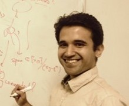

{:#photo}

[Mathematical Sciences Institute](http://maths.anu.edu.au)  
[Australian National university](http://www.anu.edu.au/)  
`anand.deopurkar@anu.edu.au`  
CV [html](cv/index.html) [pdf](cv/cv.pdf)

## Research

For my papers and preprints, see my [research](research/) page.

I am an algebraic geometer with broader interests in algebra, geometry, representation theory, and number theory. I study moduli spaces: moduli of curves, branched covers, surfaces, and so on. A lot of my research is about questions of a classical flavor, but the answers often involve modern techniques like deformation theory and stacks.  

Before coming to ANU, I was a post-doc at [UGA](http://math.uga.edu) and [Columbia](http://math.columbia.edu/), and before that I was a graduate student of Joe Harris at [Harvard](http://math.harvard.edu/).  

Just after graduate school, I wrote a [rough non-technical explanation](interests/) of my doctoral research, which might interest or amuse you.

## Upcoming and current activities

{{ site.time | date: '%s' }}

<ul>

{{ activity.when | date: '%s' }}

<li> {{ activity.display-when }}{{ activity.when | date: "%-d %b %Y" }}: {{ activity.what | markdownify | strip | remove: '
' | remove: '
'}}, {{ activity.where | remove: '
' | remove: '
'}}.</li>


</ul>

Here is my current [calendar](calendar/).

## Teaching

I am currently not teaching anything. 
Here are the notes of some of the advanced classes I have taught.

* [Math 8320, a graduate course on algebraic curves and Riemann surfaces](8320)
* [Moduli of curves at Columbia](teaching/moduli/)

For other courses taught in the past, see my [teaching](teaching/) page.
