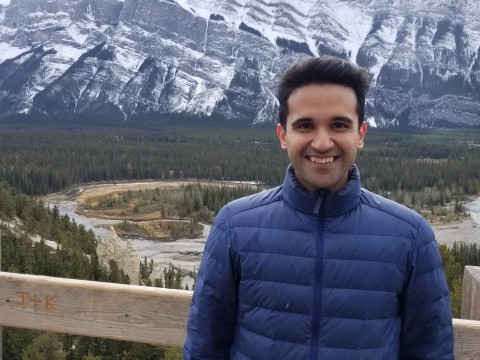

{:#photo}

[Mathematical Sciences Institute](https://maths.anu.edu.au)  
[Australian National University](https://www.anu.edu.au/)  
Hanna Neumann Building   
61 2 6125 4628   
`anand.deopurkar@anu.edu.au`  
CV [html](cv/index.html) [pdf](cv/cv.pdf)

## Research

I am an algebraic geometer with broader interests in algebra, geometry, representation theory, and number theory. This means that I study algebraic varieties&mdash;spaces of solutions of algebraic equations. Instead of studying one algebraic variety in isolation, I study the collection of all related algebraic varieties at once, using the remarkable feature that such a collection itself forms an algebraic variety (often called a "moduli space").

I have worked on moduli spaces of algebraic curves, branched covers of curves, surfaces, vector bundles, and so on. 
For my papers and preprints, see my [research](research/) page.  

Just after graduate school, I wrote a [rough non-technical explanation](interests/) of my doctoral research, which might interest or amuse you.

## Upcoming and current activities

{{ site.time | date: '%s' }}

<ul>

{{ activity.when | date: '%s' }}

<li> {{ activity.display-when }}{{ activity.when | date: "%-d %b %Y" }}: {{ activity.what | markdownify | strip | remove: '
' | remove: '
'}}, {{ activity.where | remove: '
' | remove: '
'}}.</li>


</ul>

## Teaching
This summer (southern hemisphere), I am co-running a reading course on "Elliptic curves and modular forms" by Neil Koblitz with [James Tener](https://tener.cc). Here are the notes of some of the other advanced classes I have taught.

* [A graduate course on algebraic curves and Riemann surfaces](teaching/8320)
* [Moduli of curves](teaching/moduli/)

For other courses taught in the past, see my [teaching](teaching/) page.

## Fun

I wrote a [mystery hunt style puzzle](puzzle.pdf).
