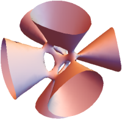

> Algebra is nothing but written geometry; geometry is nothing but pictured algebra.  
> &#x2014; Sophie Germain (1776&#x2013;1831)

> No attention should be paid to the fact that algebra and geometry are different in appearance.  
> &#x2014; Omar Khayyam (1048&#x2013;1131)

This year, the course will be on algebraic geometry, the study of algebraic equations using geometry and geometric shapes using algebra.
We will begin with affine varieties&#x2014;solution sets of polynomial equations&#x2014;and use these as building blocks to construct a rich world of geometric objects that include Riemann surfaces, projective spaces, Grassmannians, etc.

# Announcements

1.  Here is the [classwork for week 2](classwork02.pdf).
2.  [Homework 1](hw1.pdf) is up, due in two weeks (August 13) on [gradescope](https://www.gradescope.com/courses/280699) (you may have to create an account with your ANU id).

# Links

-   Lectures: 1 (Monday 10&#x2013;11, Moran G007), 2 (Wed 10&#x2013;11, Moran G008), 3 (Thu 11&#x2013;12, HN 4.41), 4 (Fri 12&#x2013;13, Moran G007)
-   Zoom lecture: <https://anu.zoom.us/j/87920733031> (you know the password)
-   Discussion forum: <https://ag2021.zulipchat.com>.
-   The assignments will be due on Gradescope (details TBA)

# References

1.  [Our own notes](notes)
2.  [Basic Algebraic Geometry, Part I by I. Shafarevich](https://link.springer.com/book/10.1007/978-3-642-37956-7)
3.  [Online notes by A. Gathmann](https://www.mathematik.uni-kl.de/~gathmann/class/alggeom-2002/alggeom-2002.pdf)

# Plan

This is a tentative outline of the course, subject to change.

<table border="2" cellspacing="0" cellpadding="6" rules="groups" frame="hsides">

<colgroup>
<col  class="org-right" />

<col  class="org-left" />

<col  class="org-left" />
</colgroup>
<thead>
<tr>
<th scope="col" class="org-right">Week</th>
<th scope="col" class="org-left">Topic</th>
<th scope="col" class="org-left">Assessment</th>
</tr>
</thead>

<tbody>
<tr>
<td class="org-right">1</td>
<td class="org-left">What is algebraic geometry? The first examples: algebraic subsets of affine space. Lecture 1: <a href="https://web.microsoftstream.com/video/cf234444-df4b-4b65-8016-a3c1b7539891?channelId=cd4289e5-e630-458c-8ea0-2bd2632faea0">Video</a>/<a href="notes/2021-07-27.pdf">Board</a>, Lecture 2: <a href="https://web.microsoftstream.com/video/9baf2139-0fa8-4419-89f2-aabff250de07?channelId=cd4289e5-e630-458c-8ea0-2bd2632faea0">Video</a>/<a href="notes/2021-07-08.pdf">Board</a></td>
<td class="org-left">&#xa0;</td>
</tr>

<tr>
<td class="org-right">2</td>
<td class="org-left"><a href="classwork02.pdf">The Nullstellensatz</a>: Lecture 1: <a href="https://web.microsoftstream.com/video/307216ea-46a1-40dd-9389-7bde7ea8b439?channelId=cd4289e5-e630-458c-8ea0-2bd2632faea0">Video</a>/<a href="notes/2021-08-02.pdf">Board</a></td>
<td class="org-left">&#xa0;</td>
</tr>

<tr>
<td class="org-right">3</td>
<td class="org-left">Regular functions and regular maps</td>
<td class="org-left">Assignment 1</td>
</tr>

<tr>
<td class="org-right">4</td>
<td class="org-left">General algebraic varieties</td>
<td class="org-left">&#xa0;</td>
</tr>

<tr>
<td class="org-right">5</td>
<td class="org-left">Functions and maps on projective varieties</td>
<td class="org-left">Assignment 2</td>
</tr>

<tr>
<td class="org-right">6</td>
<td class="org-left">Products and the Segre embedding</td>
<td class="org-left">Mid-semester exam</td>
</tr>

<tr>
<td class="org-right">7</td>
<td class="org-left">Completeness of projective varieties</td>
<td class="org-left">&#xa0;</td>
</tr>

<tr>
<td class="org-right">8</td>
<td class="org-left">Irreducibility</td>
<td class="org-left">Assignment 3</td>
</tr>

<tr>
<td class="org-right">9</td>
<td class="org-left">Rational maps</td>
<td class="org-left">&#xa0;</td>
</tr>

<tr>
<td class="org-right">10</td>
<td class="org-left">Dimension</td>
<td class="org-left">Assignment 4</td>
</tr>

<tr>
<td class="org-right">11</td>
<td class="org-left">Grassmannians</td>
<td class="org-left">&#xa0;</td>
</tr>

<tr>
<td class="org-right">12</td>
<td class="org-left">Tangent spaces and singularities</td>
<td class="org-left">Assignment 5</td>
</tr>
</tbody>
</table>

# Pre-requisites

Algebra 1 and Algebra 2.

Algebraic geometry interacts deeply with many other areas of mathematics, so some background in topology, complex analysis, and differential geometry will be helpful, but not required. 

# Assessment

The final mark is based on three factors.

1.  (50%) Homework + classwork
2.  (25%) A mid-semester exam (take-home, in-person, or Zoom)
3.  (25%) A final exam (take-home, in-person, or Zoom)

The classwork will consist of presentations and the associated write-up, each equivalent to 1 homework set.
If you are a masters student or taking the course as an ASC/ASE, your assessment will include an additional project component.

## Classwork

The format of our classwork will be as follows. The first meeting of the week (Monday) will be a traditional lecture in which I will explain the key ideas of a topic, but not prove all the details. In the following three meetings (Wednesday, Thursday, Friday), we will work out the details in small groups. Every day, two students (selected at random) will present designated parts of the material, and two students (also selected at random) will write them up. I will add the write-ups to [our notes](notes). You can see what the next few week's plan is ahead of time in the notes.

# Policies

## Late submission

I will not accept any late submissions, except for medical emergencies with a medical certificate.
To compensate for this strict policy, I will drop the lowest among the (homework+classwork) marks.

## Collaboration

You are allowed, even encouraged, to work with others on homework assignments, but you must write up your solutions **on your own**. In other words, you **may not** copy someone else's write-up and you **may not** write your solutions side by side with someone else. On your submission, you must write the names of your collaborators. This is a matter of academic honesty; it will not affect your marks. 

There will be no collaboration on the exams.

